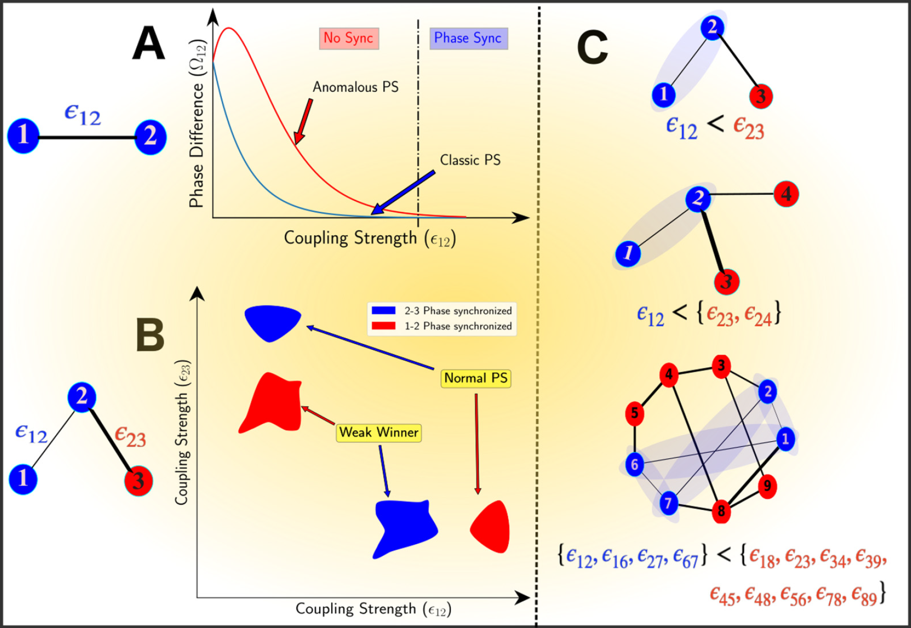

## Weak-winner phase synchronization: A curious case of weak interactions
### This repository reproduces some of the results published in the following manuscript:
* https://arxiv.org/abs/1812.02642

---
External libraries required to compile the code:
* 
* 

